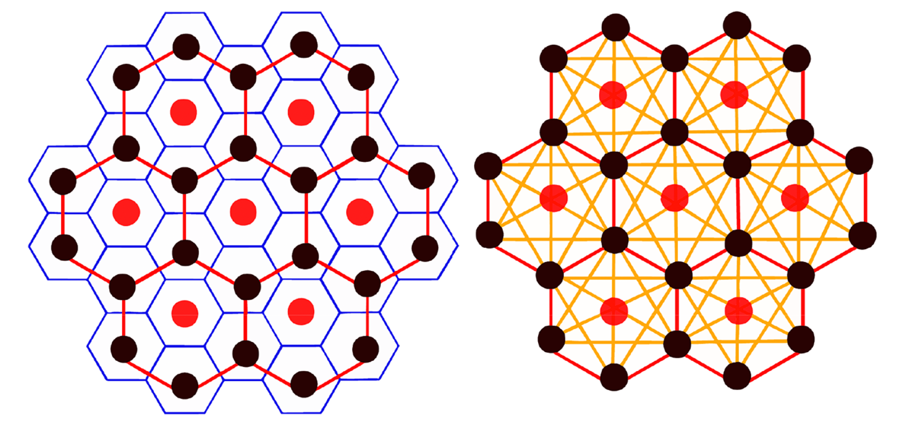

[](https://doi.org/10.5281/zenodo.14825532)

# Martini 3 model of Graphene
<p align="center">

</p>

Generates a Martini 3 model of both finite and infinite graphene sheet for running the molecular dynamics simulation with the Gromacs simulation package. The script outputs both the structure file (.gro) and a topology file (.itp).


## Requirements

Python 3 with packages argparse, math, sys, numpy, MDAnalysis. The requirements can be found in requirements.txt.

## Usage

For generating the structure and topology of a finite graphene sheet, run
 ```python
 python Non-Periodic/martini3-graphene-topology.py -x [Length of the graphene sheet along x in nm] \
                                         -y [Length of the graphene sheet along y in nm] \
                                         -z [Length of the box along z in nm]
                                         -o [Name of the output for both structure and topology] \
 ```                                  

for example

    python Non-Periodic/martini3-graphene-topology.py -x 21 -y 23 -z 30 -o graphene

All arguments are optional. If an argument is not used, the default value for their dimension (12 nm), and the name of the output (martini_graphene) is used.

Similarly, for generating the structure and topology of an infinite graphene sheet, run

    python Periodic/martini3-graphene-periodic.py -x [Length of the graphene sheet along x in nm] \
                                         -y [Length of the graphene sheet along y in nm] \
                                         -z [Length of the box along z in nm]
                                         -o [Name of the output for both structure and topology] \
                                    

for example

    python Periodic/martini3-graphene-periodic.py -x 21 -y 23 -z 30 -o graphene

All arguments are optional. If an argument is not used, the default value for their dimension (12 nm), and the name of the output (martini_graphene) is used.

## License  
This project is licensed under the MIT License - see the [LICENSE](https://github.com/MoMS-MMSB/Martini3-Graphene/blob/main/LICENSE) file for details.

## Citation

If the script or the model is helpful, please cite:  
[1] Shrestha, R., Alessandri, R., Vögele, M., Hilpert, C., Souza, P. C., Marrink, S. J., & Monticelli, L. Journal of Chemical Theory and Computation, 2025, 21(18), 9035–9053.


