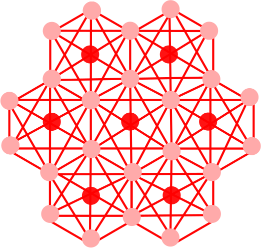

# Martini 3 model of Graphene

Generates a Martini 3 model of both finite and infinite graphene sheet for running the molecular dynamics simulation with the Gromacs simulation package. The script outputs both the structure file (.gro) and a topology file (.itp).

## Requirements

Python 3 with packages argparse, math, sys, numpy, MDAnalysis. The requirements can be found in requirements.txt.

## Usage

For a generating the structure and topology of a finite graphene sheet, run

    python martini3-graphene-topology.py -x [Length of the graphene sheet along x in nm] \
                                         -y [Length of the graphene sheet along y in nm] \
                                         -z [Length of the box along z in nm]
                                         -o [Name of the output for both structure and topology] \
                                    

for example

    python martini3-graphene-topology.py -x 21 -y 23 -z 30 -o graphene

All arguments are optional. If an argument is not used, the default value for their dimension (12 nm), and the name of the output (martini_graphene) is used.

Similarly, for a generating the structure and topology of an infinite graphene sheet, run

    python martini3-graphene-periodic.py -x [Length of the graphene sheet along x in nm] \
                                         -y [Length of the graphene sheet along y in nm] \
                                         -z [Length of the box along z in nm]
                                         -o [Name of the output for both structure and topology] \
                                    

for example

    python martini3-graphene-periodic.py -x 21 -y 23 -z 30 -o graphene

All arguments are optional. If an argument is not used, the default value for their dimension (12 nm), and the name of the output (martini_graphene) is used.

## Notes

* The repository also contains all the tools required to reproduce the enthalpies of adsorption which is used for the validation of the model. 
* Following the parametrization of graphene, we have also develped the Martini 3 model of graphene oxide. The script can be found here.

## Literature

If the script or the model is helpful, please cite:

